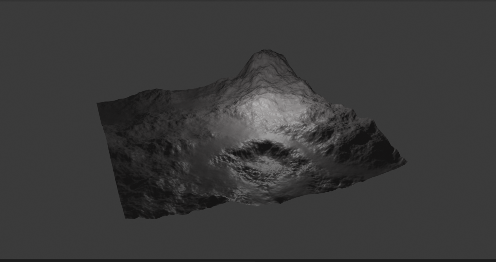
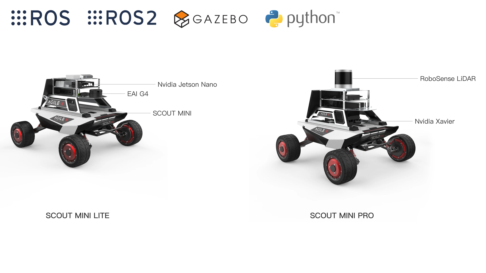

# POINT TRANSFORMER TERRAIN SEGMENTATION FROM 3D-LIDAR POINT CLOUDS
This repo is the official project repository of my project **_POINT TRANSFORMER TERRAIN SEGMENTATION FROM 3D-LIDAR POINT CLOUDS_**, which will display and explain key features.

  
  

<!-- Connect with me -->
<h3 align="center">Tech Stack</h3>

